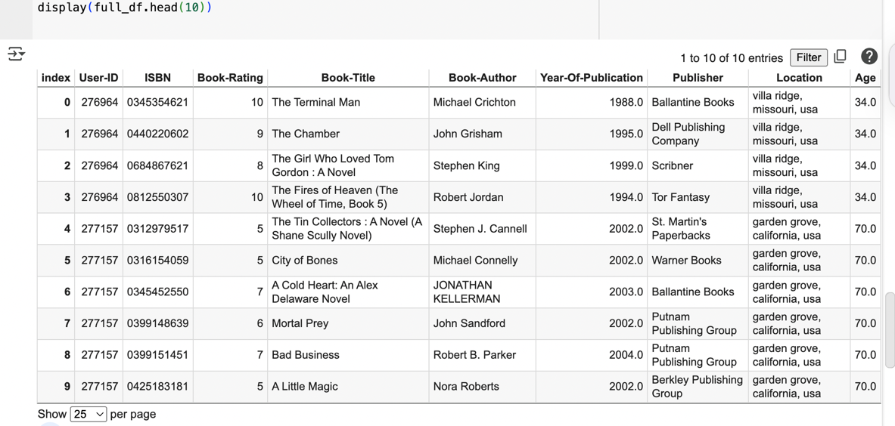
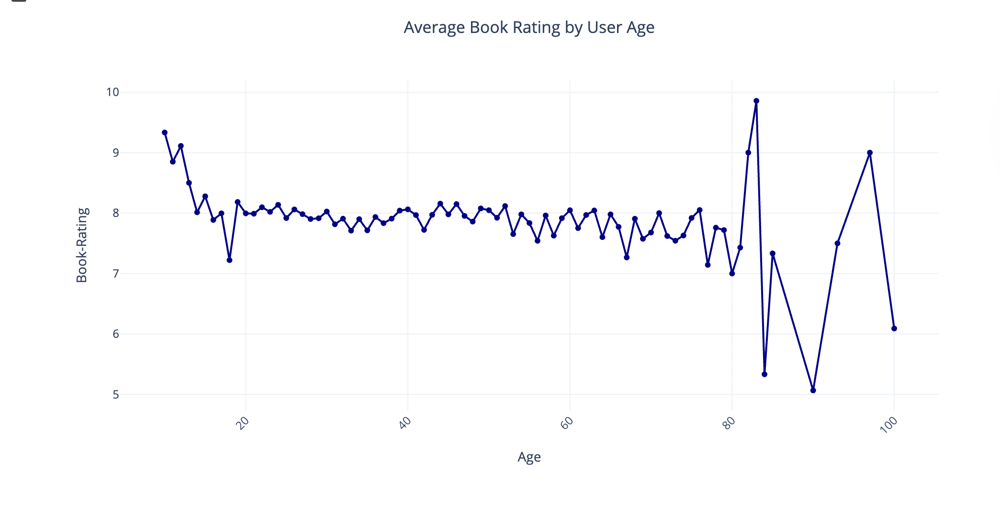

Book-cross Recommendation System Implementation

I.Introduction :

In today's modern era, consumers are faced with an overwhelming number of options, whether they are books, movies, goods, or services. Here comes the use of Recommendation engines, that are essential tools that help users locate relevant content by predicting their preferences based on similarity to other users or things or past usage. These technologies are widely used by websites like Amazon, Netflix, and Goodreads to increase user satisfaction and engagement.

This project aims to develop a solid recommendation system focusing on Book Recommendation dataset from Kaggle .

Project scope :

Imagine going on a book website and with a click seeing a whole book list you never knew you liked but now wanted to read. That's what a smart recommendation system does, and it's exactly what we hope to make. We use real-world data to build a hybrid system that combines two successful techniques. one being content-based filtering, which looks closely at the attributes of things, and the other one is collaborative filtering, which learns from the choices of similar users.

After organizing and cleaning a large set of real-world case ratings, we created models to learn and predict preferences and then compare them to how well we jointly fit the ratings of the user. Along the way, to aid us in judgment, we will also visualize some data patterns.

Project objective :

The project involves a simple yet extraordinary aim which should help assist a person in picking the "right" book at the right time.  Intelligent recommendation systems are indeed necessary, since even an avid reader sometimes feels overwhelmed with hundreds of thousand volumes to be considered.  Our objective is to design and test a hybrid recommender system that understands the underlying features of the books a user has liked, combined with their actual previous ratings.

II.Data understanding : 

Dataset Overview :

The dataset consists of three individual files named ''Books.csv'', ''Ratings.csv'' and ''Users.csv''. The Books dataset contains metadata information about each book including its title, author, publisher and its publication year. The Ratings dataset contains user-generated book ratings, which connect each user to a book that has a rating from 0 to10. Finally ,The Users dataset contains demographic information about every user including their age and location . The combination of these datasets allows us to deliver customized book recommendations by analyzing user preferences.

After the Data exploration:

During my initial exploration, one major finding was that the Books dataset mainly consists of string data types, with the presence of some pretty unnecessary picture URLs and a quite few missing values in significant places like the Book-Author and Publisher columns. It is quite necessary to convert the Year-Of-Publication column from text to a numeric format. 

Ratings dataset, even if it appears complete and clean, does contain ratings of 0, which should be removed as they denote implicit interactions rather than actual user feedback.

The Users dataset contains numerous entries for Age column that are absent while some age entries probably being nonsensical. My next step in data preprocessing involves removing or correcting malformed entries and discarding all missing values to make the data ready for modelling.

III.Data Preprocessing :

1.Data cleaning and merging :

To get the data ready for modelling , first I combined the cleaned ratings dataset with the books dataset using  books ISBN column join, and then I combined it with the users dataset using User-ID . Book descriptions, book ratings, and user information are all now included in the one dataset.  Every component required to construct recommendation systems that rely on collaborative analysis and content is included in the entire dataset.

Here is a snapshot from my code of how the cleaned dataframe looks like : (only the first 10 rows )

2.Train/Test split :

After getting the final merged dataset , it was split into training and testing data sets for performance evaluation of the recommendation system. This kind of separation allows to perform fair and realistic assessment, where the model learns from the training data and its performance is assessed on unseen entries in the test set. An 80%-20% split was implemented; we will test on 10451 entries consisting and train on 41802 entries . Before splitting, duplicates were removed to ensure that each user-book interaction was unique to avoid data leakage and improve generalization of results.

IV.Data Analysis :

Prior to the modeling part of the recommendation system, one part that is necessary to dive into is the data visualization analysis. This is useful in detecting whether there is any hidden trends or outliers or biases that could affect the model negatively. We help with this challenging task by visualizing user activity, rating distributions, and engagement across demographic subsets,  to provide a strong base for better modeling.

1.Histogram of Book Ratings’ distribution :

Figure 1: Distribution of book Ratings

This histogram -see figure 1- shows the count of ratings of book and the range of book rating along the dataset. The majority of our ratings are at the high end of the scale, which means that its a right skkewed histogram, with many falling between 7 and 10, a sign that users either rate generously, or don't bother rating books they don't like. However , Ratings between (1–4)  happen much less frequently, possibly inducing a positivity bias in the extracted corpus. This observation informs the modeling step, as collaborative filtering models may need to account for skewed rating behavior to avoid recommending only overly popular books.

2. Line Chart - Average Book Rating by User Age :

Figure 2: Average book rating by User age

This chart illustrates how the average rating behaviour changes with user age, as shown in figure 2. Younger users (teens) generally assign slightly higher values to books compared to older users, and we observe that the ratings for the high age range fluctuate a bit, likely due to having fewer data points being averaged together. This phenomenon is important to recognize because it indicates that age may influence one’s perspective and evaluation of a book. If we incorporate this into the personalization based on demographics in the recommendation model later on, this age-based pattern could help improve targeting or clustering.

3. Bar Chart : Top 10 Most Active users by average rating count 

Figure 3: Top 10 Users by Average rating counts

This visualization displays the top 10 users who rated most of the movies. It also helps us to understand who the signal users in the system are and how much  they can impact the recommendation model -see figure 3. Recognizing power users in turn, facilitates collaborative filtering by being able to make suggestions for new and/or less active or inactive users, basing those suggestions on the behavior of these active profiles. However, they may also bring some bias, thus how to deal with their influence is valuable to model tuning.

V.Data Modelling :

1.Collaborative filtering (CF):

1.1.Item-Based CF : 

Label Encoding:
To create a matrix for similarity analysis, I re-encoded User-ID and Book-Title to numeric indexes through LabelEncoder. This is in order to convert categorical values to a form that does not mess matrix operations or in other words to normalize labels.

Sparse Matrix Creation :
User-book interactions were represented using a sparse matrix:
Rows as users, Columns as books, and Values are the ratings that users have given to books. This matrix is, in turn, space-efficient and enables us to run similarity-based algorithms at scale.

Cosine Similarity Calculation :
I then computed cosine similarity between books (item-item), resulting in a square matrix with each entry [i, j] measuring how much similar book i is to book j, based on users’ rating patterns.

Recommendation Logic: 
I developed a recommendation system that:
1.Takes a book title as input
2.Finds its encoded index
3.Then retrieves the nearest books using cosine similarity matrix,
4. Print the top 5 similar books along with similarity scores.

Finally, I included a string matching fallback to enhance user input processing if the title cannot be precisely located.

1.2.User-Based CF :

User Based Collaborative Filtering (UBCF), recommends the books to a user by finding out other users who have assigned the similar ratings. The underlying notion is that people who think similarly also tend to enjoy the same kinds of books. So if User A is like User B, the system recommends books that User A hasn’t read yet and that User B liked.

Data Cleaning: 
In order to build a cleaner base for this model, I cleaned the data by removing all rows with missing values of ''Book-Rating'' , ''User-ID'' and ''Book-Title''.

Encoding & Sparse Matrix:
Users, books were encoded to numerical indices. A ''csr_matrix '' was constructed just like in IBCF with:
Rows = users,
Columns = books,
Values = ratings.

Cosine Similarity: 
I calculated user-to-user similarity using cosine_similarity to generate a similarity matrix indicating how alike each user is to the other users.

Recommendation Logic:
It searches for the 10 most similar users to the user with given index.
Then it pulls books rated by these similar users that the target user has not seen yet.
Finally, It averages them to get the average ratingof these books, and we recommend the top 5 books

2.Content-Based filtering :

In content-based recommendation system, the aim is to recommend books based on their own textual content, I chosed it to be title, and author for each book. The idea behind content-based filtering is that users are likely to be choosy about books that are similar to books they’ve liked in the past . 

Data Pre-Processing and choosing the right dataframe :
I first joined the Books and Ratings datasets to consider only rated books. To prevent duplicates and circumvent memory-related problems, subsequent to sorting, I removed duplicates according to book titles, matched with authors. I concatenated Book-Title and Book-Author and referred this feature as ''combined_features'' for all the books.

TF-IDF Vectorization (Text Mining Technique) :
I transformed the text values into numerical formmby using the TF-IDF method. This turned the pure text of each book to a number vector representing the significance of alphabetical words, with stop words removed. TF-IDF allowed us to extract the semantic content as well as the specificity of terms across all books.

Cosine Similarity Matrix: 
The similarity function took the cosine similarity between every pair of books, after vectorizing the books with TF-IDF. This gave us a square matrix where each entry (i, j) captures the similarity between book i and book j given their text vectors. This is the heart of the recommendation system: we look for the books most similar to any given input.

The recommendation function :
I utilized the '' get_close_matches() '' function of Python’s ''difflib'' module to handle the user input better. This serves as a fuzzy matching layer, used to find and suggest book titles that closely match the user’s input, even when there is a typo or case mismatch. In this way, the system becomes more user-tolerant and user-friendly towards the input variation.

Recommendation Output:
Once a valid title is found, the system retrieves the 5 books with the highest similarity scores in the similarity matrix (and that do not include the book itself). The guidelines are listed with their title and authors. Because I had already observed that the average ratings were biased (lots of 10), I opted to not show a rating at all and to go by just similarity-based relevance instead.
VI.Evaluation & Discussion :

In this project, I decided to evaluate all three recommendation system models with regard to Root Mean Squared Error (RMSE) because it is a common metric used to evaluate recommendation systems. RMSE allows for direct comparison to actual user ratings which makes predicting error rates easier to see. RMSE also penalizes larger errors more than smaller errors, which helps assess how your model will generalize to unseen data. 

1.Item-Based Collaborative Filtering (IBCF) RMSE: 

For the IBCF model, we calculated RMSE by predicting ratings on the test set for each user-book combination using item-item similarity (from the constructed cosine similarity matrix from the training data). This means we predicted ratings based on actual user-item similarity, as we compared predicted ratings to real ratings using RMSE. The RMSE value was ~1.75 which means that IBCF model was able to predict ratings with some accuracy. 

2.User-Based Collaborative Filtering (UBCF) RMSE:

For this model, we used the user-item rating matrix and compared predicted ratings to the real ratings based on the test dataset. For the UBCF, a RMSE of ~1.92 was calculated, showing that while still valid, the predictions were less accurate than the IBCF model because of the data sparsity between users.

3.Content based filtering (CBF) RMSE:

In the CBF model, we used a TF-IDF vectorizer on book titles and authors in order to create a content similarity matrix. Then we predicted each test rating by taking the average of the top 5 most similar books (based on content) and comparing their predicted ratings with the actual test ratings.
In the end, we obtained an RMSE of ~1.95, which is a little higher than collaborative models, because CBF doesn't involve any user behavior.

4.Comparison and Interpretation:

To compare each of the three models, their RMSE scores were plotted together in one bar chart.

The bar chart in figure 4 below ,demonstrates that the lowest RMSE score was achieved by Item-Based CF (1.756), followed by User-Based CF (1.926) and lastly Content-Based Filtering (1.954).

This result indicates that, for this dataset, item similarity is the best strategy for accurate recommendations. This comparison shows how considering evaluation on a test set will help identify the best model to help make predictions on unseen ratings.	

Figure 4: Recommendation Models Comparison

VII.References :

“Book Recommendation Dataset.” Www.kaggle.com, www.kaggle.com/datasets/arashnic/book-recommendation-dataset/data. (KAGGLE DATASET)
Cai, Chenwei, et al. SPMC: Socially-Aware Personalized Markov Chains for Sparse Sequential Recommendation.
Zhao, Tong, et al. “Improving Latent Factor Models via Personalized Feature Projection for One Class Recommendation.” Proceedings of the 24th ACM International on Conference on Information and Knowledge Management, 17 Oct. 2015, pp. 821–830, cseweb.ucsd.edu/~jmcauley/pdfs/cikm15.pdf, https://doi.org/10.1145/2806416.2806511. Accessed 19 June 2025.
